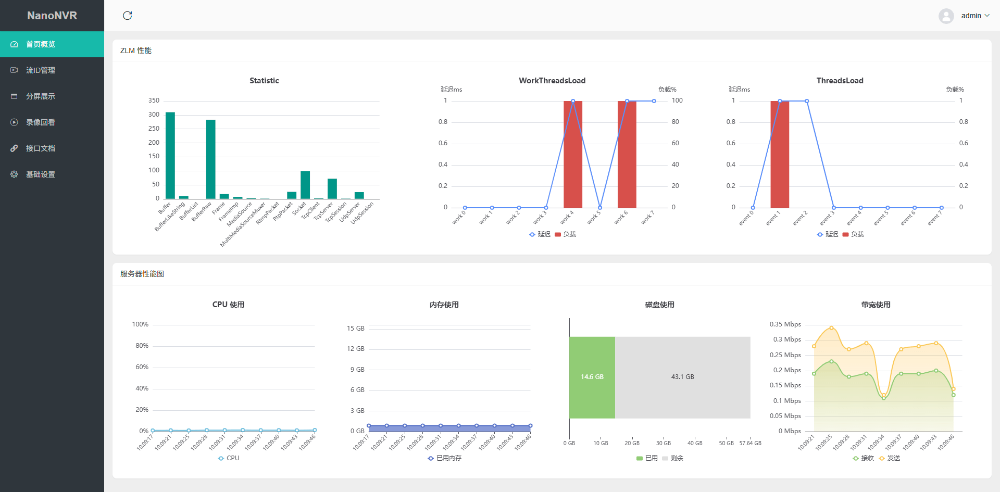
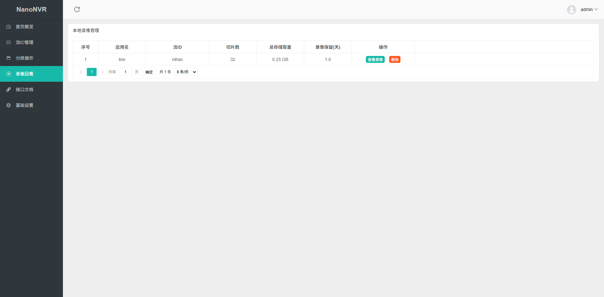
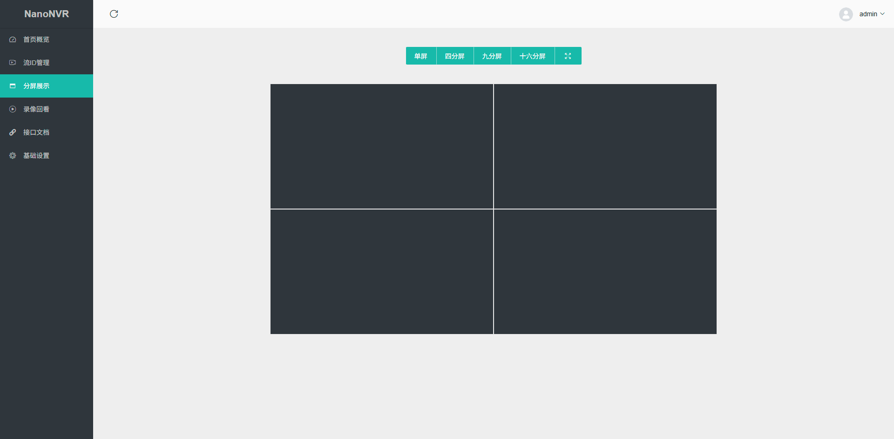

<div align="center">
  
  <h3>NanoNVR</h3>
  <a>
    
    
    
  </a>
</div>


### 概述

一个极简、轻便的 NVR

### 快速启动

本项目推荐 docker 部署

```bash
cd ./docker
docker-compose up -d
```

如果修改参数后需要重启

```bash
docker-compose restart
```

### 效果图








### 详细功能

- 监控台
- 流ID管理
- 分屏展示
- 视频本地录制
- 接口页面
- 配置设置

